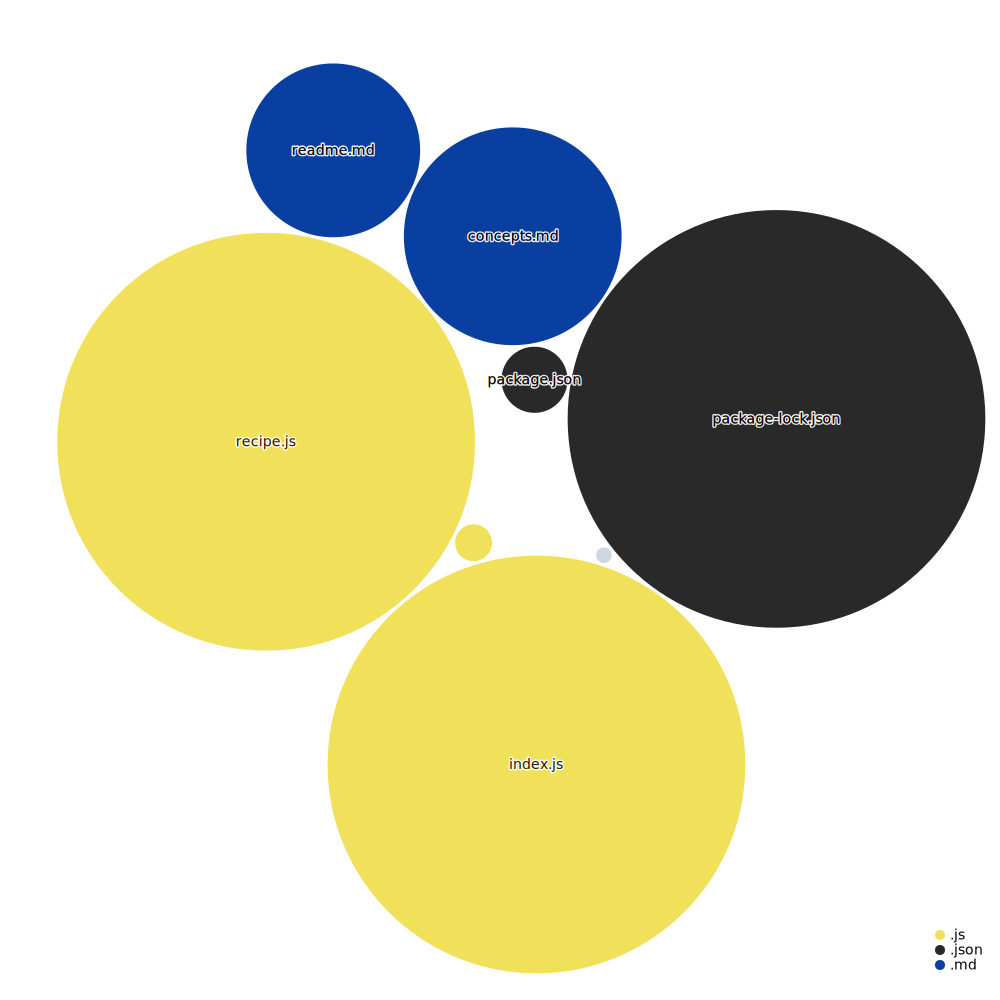

# OpenAI API CodeX - Hello World

This app is really simple.  It will eventually generate the space of all possible programs.

## if you hate reading
clone this repository and throw it in Replit or whatever nodejs environment you like.
apply for codex beta at openai.com/join

*** note that you cannot go to production in the beta without a review.  this code is for learning and demostration.  it will be very thirsty for tokens so be sure you know what you're getting into :) and read the documentation here and at openai! ***

### a preamble of sorts
https://github.com/un1crom/openai-codex-hello-world/blob/master/concepts.md

## A Little More Detail
Within this code and through integration with OpenAI API you can start generating, running and publishing to github OpenAI Codex generated code.

This is also the fastest way to iterate through good codex prompts.

Basically...
1. we start with a seed/prompt.
2. classify the prompt for type of code it might generate and set Codex params accordingly
3. generate code, classify what kind of code it is
4. run code in virtual machine
5. if errors process errors and generate a new seed to try to get running code
6. keep iterating for number of max iterations
7. if successful code then save code to github gists (mine end up here: https://gist.github.com/un1crom)
8. as a bonus... you can use successful code via GIST urls as you build up a codebase.  it's all quite recursive and lovely.

### "but what should i see?"

your code and all the processing will output to console.

all successful codex code will end up as a GIST on github as specified by your github PAT and the gist call you make.

## LANGUAGES SUPPORTED
Javascript.  It is possible to do this for Python and other interactive languages but you have to create/instrument various virtual machines.  Javascript is the best for this because VMs are on server and in browser.

## Why Hello World?

You're about to blow a lot of time playing with OpenAI API CodeX.  You're going to try to outwit it or outwit your friends.  We all tried to do this with GPT3 as well.

Here's the thing... the value of AI isn't in you being clever, IMO.  Maybe AI should be more about giving the machine room to explore in ways you would never think up!

Also... This code base will save you a lot of time.  I have already hooked up classification, error handling, automatic code gen and running and posting to github!  So now you can make more things even faster!

My only goal was to see how fast we could all explore the space of possibilities.
